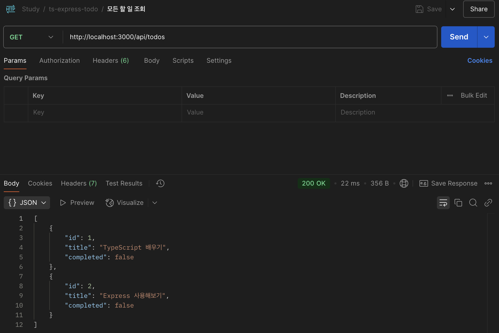

# TypeScript와 Express를 활용한 REST API 프로젝트


## 프로젝트 개요
`TypeScript`와 `Express`를 활용하여 구축한 REST API 프로젝트입니다.  
To-Do 리스트 조회, 추가, 수정, 삭제 API를 제공합니다.

## 선행 작업
1. node, npm, npx 설치
```bash
brew install node
```

## 실행 방법
1. 어플리케이션 실행하기
```bash
npx ts-node-dev index.ts
```
2. 어플리케이션 정상 실행 확인하기
- http://localhost:3000 접근
- 

## 테스트 방법
1.  To-Do 리스트 전체 조회 API 테스트 하기
- http://localhost:3000/api/todos GET 호출
- 

2. To-Do 추가 API 테스트 하기
- http://localhost:3000/api/todos POST 호출
- Body Format = {"title":"To-Do 제목"}
- 
- 

3. To-Do 완료 처리 API 테스트 하기 
- http://localhost:3000/api/todos/:id PUT 호출
- 
- 

4. To-Do 삭제 API 테스트 하기
- http://localhost:3000/api/todos/:id DELETE 호출
- 
- 